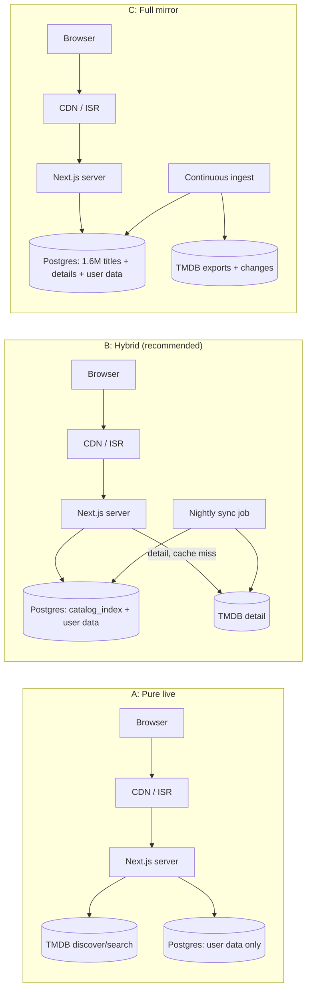
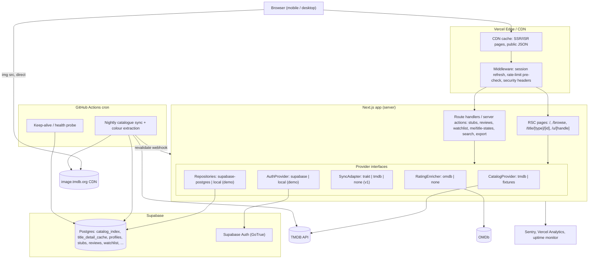
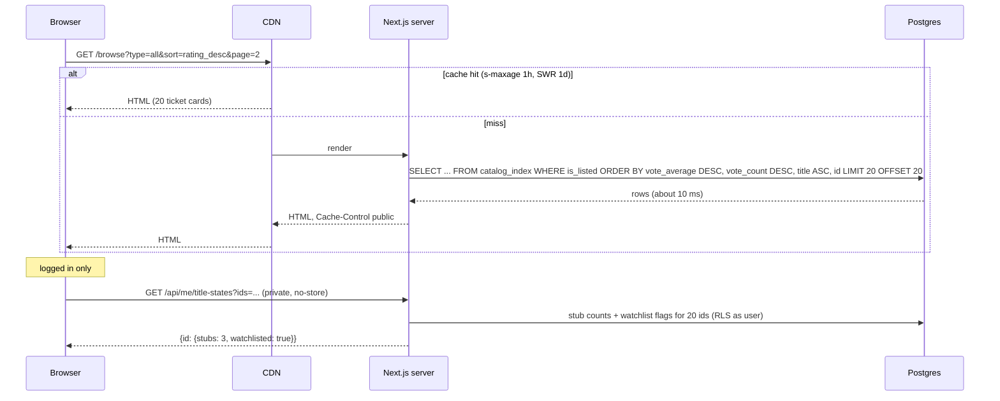
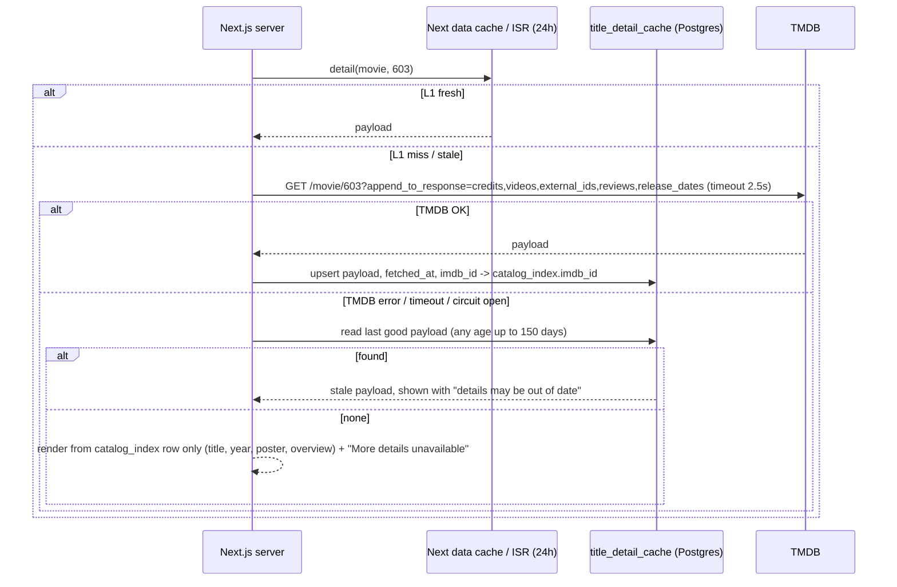
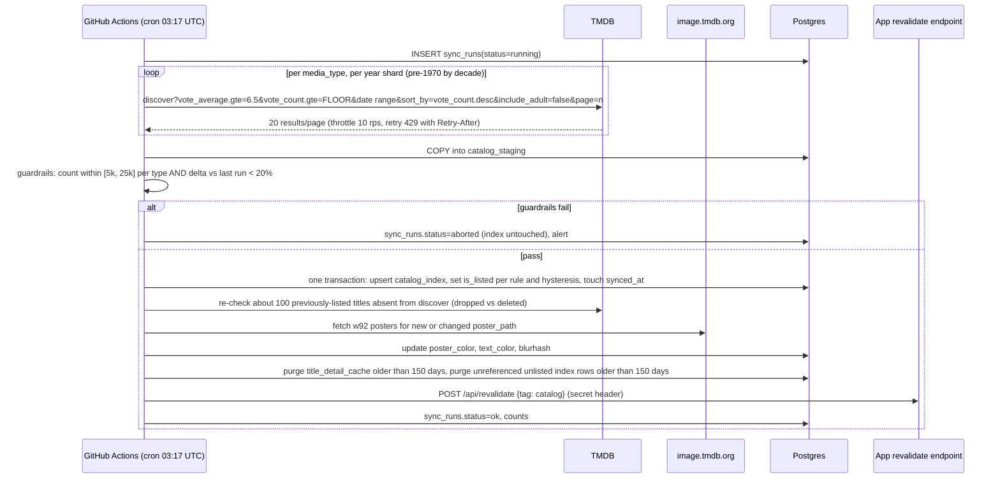
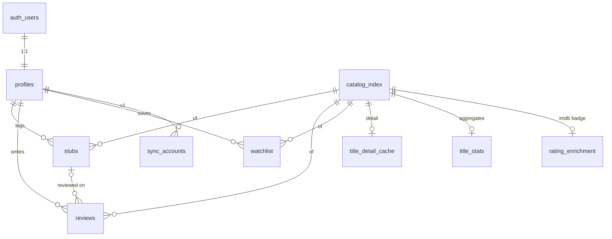
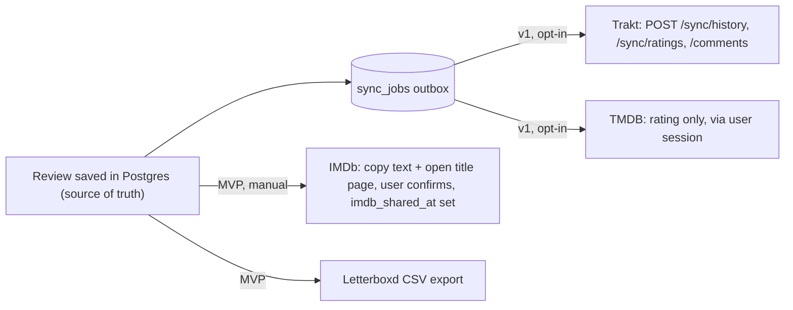

# Stubbed — System Design

Author: System Designer · Date: 2026-09-26 · Status: **Options for the Architect** (the Architect makes the final call in ADRs)
Inputs: `docs/00-orchestrator/BRIEF.md`, `docs/01-product/PRD.md`, `docs/01-product/research.md`. `docs/02-design/` was being written in parallel, so this doc assumes a Next.js-style SSR web front end with poster-tinted UI.

Conventions:
- **(verify)** marks a vendor limit or price that must be re-checked on the primary page before launch. The research phase could not fetch vendor pages directly.
- **(est.)** marks a number that comes from a model in this doc, not from a measurement.
- "Index" or `catalog_index` means the curated title table that holds list and sort fields. "Detail" means the heavy per-title payload: cast, videos, TMDB reviews and external IDs.

---

## 0. TL;DR

| Topic | Recommendation (Architect decides) |
|---|---|
| Founder Q1 "why a DB, not real-time?" | **Option B, a hybrid.** A nightly-synced curated `catalog_index` table (about 10–15k rows, about 15 MB) serves browse, sort, search and joins. The heavy detail payload is fetched **live** from TMDB on first view and cached for 24 h (CDN/ISR plus a DB copy kept for outages). User data (stubs, reviews, watchlist) must live in our DB whichever option is chosen. |
| Why not pure live (A) | It works at 1k MAU. It breaks on **correctness** before it breaks on scale. "All" (movie + TV) sorting cannot be paginated correctly. Search cannot be limited to the curated set without multi-page waterfalls. Tie-breaks are not deterministic. The app would depend hard on TMDB uptime and on per-IP soft limits from shared serverless IPs. |
| Why not full mirror (C) | It needs about 1.6M rows and over 3 GB, which is past free tiers. The 6-month cache rule creates a refresh obligation for every row. There is no product benefit, because browse only shows the curated set. |
| Stack (free tier) | **Vercel Hobby + Supabase Free** (Postgres, Auth, RLS). Scheduled jobs run on **GitHub Actions cron**, which also stops Supabase's 7-day idle pause. Alternatives are scored in §6. |
| Images | Serve **directly from `image.tmdb.org`** at sized variants. Do not proxy them and do not use Vercel image optimisation. |
| Poster colour | Compute it **at ingest** from the `w92` poster. Store the hex colour, a contrast-safe text colour and a BlurHash on the index row. Precompute them in fixtures. |
| Demo mode | This is a first-class provider (`fixtures`) behind the same interfaces. It needs no network at all, persists locally, and bundles local SVG posters. |

---

## 1. Requirements

### 1.1 Functional (from PRD §5–6)
| ID | Requirement | System implication |
|---|---|---|
| F1 | Browse movies and shows in the curated set only (`vote_average ≥ 6.5`, votes ≥ 200 for movies and ≥ 100 for TV, all configurable) | The curated filter is applied in a single place: `is_listed` on the index. |
| F2 | Sort by release date (asc/desc) and rating (asc/desc). Ties break by vote count desc, then title. The order must stay stable across pages, and the view must be shareable by URL. | A deterministic total order is needed, which means a DB `ORDER BY` with a unique final key. |
| F3 | Type filter All/Movies/Shows. Shows sort on `first_air_date`. | Movies and TV must be in **one** sortable relation. |
| F4 | Search the curated set (partial match, case- and accent-insensitive), with a "Not in Stubbed" state for titles outside it | Local full-text or trigram search over the index. |
| F5 | Title detail: cast, crew, videos, TMDB reviews, IMDb ID, and an optional IMDb badge via OMDb | Live fetch with caching. |
| F6 | Accounts (email + password, magic link, Google P1), profiles with a unique handle | Auth provider plus a `profiles` table. |
| F7 | Stubs (many per title), watchlist, reviews (one per user per title) | Transactional DB with per-user authorisation. |
| F8 | Export to Letterboxd CSV and JSON | A server-side streaming export. |
| F9 | Hysteresis: titles that drop below the rule are hidden from browse but still reachable by URL and in diaries | `is_listed` is separate from row existence. Rows are never deleted while they are referenced. |
| F10 | Demo mode with no keys: at least 60 seed titles, local auth, local persistence | The provider abstraction plus a fixture DB. |

### 1.2 Non-functional
| Area | Target |
|---|---|
| Performance (PRD E3) | Title page LCP < 2.5 s (mobile 4G), browse FCP < 1.5 s, CLS < 0.1. Server p95: list or search API < 150 ms, detail cache hit < 100 ms, detail cache miss < 800 ms. |
| Availability | Public read pages: 99.9%, and still readable when TMDB is down. Writes: 99.5%. |
| Scale | 1k → 10k → 100k → 1M MAU, with the same architecture and paid tiers switched on progressively (§11). |
| Cost | $0/month up to about 10k MAU. Costs stay roughly linear after that, with no cliff that forces a rewrite. |
| Compliance | TMDB attribution. TMDB content is not cached longer than 6 months. IMDb datasets are not used as the catalogue. OMDb is CC BY-NC. The product stays non-commercial until licences change (PRD D13). |
| Security | No secrets in the client. Row-level authorisation. Rate limits of 30 stubs/min and 10 reviews/min per user (PRD E5). Sanitised review text. |
| Portability | Plain Postgres SQL migrations, and vendor features only behind interfaces. Moving to Neon, Cloudflare or self-hosting takes days, not weeks. |
| Testability | Demo mode drives the same code paths as live mode. The TMDB adapter has contract tests against recorded fixtures. |

### 1.3 Load model (est., used everywhere below)
| Assumption | Value |
|---|---|
| Page views per MAU per month | 20 |
| Page-view mix | 40% browse/home, 10% search, 40% title detail, 10% profile/diary |
| Peak-to-average ratio | 4× |
| Cards per browse page | 20 |
| Stubs per MAU per month | 4 |
| Reviews per MAU per month | 0.4 |

| MAU | PV/month | Avg PV/s | Peak PV/s | Stub writes/month |
|---|---|---|---|---|
| 1k | 20k | 0.008 | 0.03 | 4k |
| 10k | 200k | 0.08 | 0.3 | 40k |
| 100k | 2M | 0.8 | 3 | 400k |
| 1M | 20M | 7.7 | 31 | 4M (about 1.5/s avg) |

Viral share spikes, where one title page gets 10–100× traffic for an hour, matter more than the average. They are handled by CDN caching of public pages.

---

## 2. Data-source evaluation matrix

| Source | Coverage | Rate limit / quota | Licence and cost | Write support | Role in Stubbed |
|---|---|---|---|---|---|
| **TMDB API v3** | About 1.39M movies and 234k TV shows, with images, credits, videos, reviews, external IDs and watch providers | No daily cap. Soft limit of about 40–50 req/s per IP, CDN about 20 connections per IP (verify) | Free non-commercial with attribution. Content cached ≤ 6 months. Commercial about $149/month (verify) | User ratings and watchlist via session (not reviews) | **Primary catalogue.** v1: rating push |
| TMDB image CDN (`image.tmdb.org`) | All posters and backdrops at fixed widths (`w92` … `original`) | CDN, generous (verify) | Covered by TMDB terms | — | Images, hot-linked |
| **OMDb** | IMDb rating and votes, RT and Metacritic | 1,000 req/day free, Patreon tiers higher | CC BY-NC (verify) | None | Optional IMDb badge (P1), cached ≥ 7 days |
| IMDb non-commercial datasets | All IMDb titles, ratings, basic metadata, **no posters or plots** | Daily TSV dumps | Personal and non-commercial, **no online database** | None | **Excluded** from runtime. Offline threshold analysis only |
| IMDb API (AWS Data Exchange) | Full | Contract | About $150k/year (verify) | **None** (read-only) | Excluded |
| **Trakt** | Movies, TV, episodes | GET about 1,000 per 5 min per user, POST about 1/s | API app needs VIP (about $60/year). Free users get one connected app | History (plays), ratings, comments (≥ 200 words counts as a review) | v1 opt-in outbound sync adapter |
| Simkl | Movies, TV, anime | Free developer API | Free | History, ratings (no reviews) | v2 adapter |
| Letterboxd | Films | Closed API | — | CSV **import** by the user | Export format only |
| Watchmode | Streaming availability plus deeplinks | About 2,500 credits/month free | Non-commercial free tier | None | v2 if deeplinks are needed |
| TMDB watch/providers (JustWatch data) | Per-region availability | Part of TMDB | JustWatch attribution required | None | v1 "Where to watch" |

**Conclusion:** TMDB is the only source that is legally usable, free and complete for a public catalogue with TV. Everything else is an optional enricher or a sync target, hidden behind interfaces:
- `CatalogProvider`: `tmdb` | `fixtures`
- `RatingEnricher`: `omdb` | `none`
- `SyncAdapter`: `trakt` | `tmdb` | `none`

---

## 3. Founder Q1 — "Why put everything in a DB? Can't it be real-time?"

### 3.1 Split the question
1. **User data (accounts, stubs, reviews, watchlist, profiles).** No external API will store these for us. IMDb has no write API and TMDB accepts no reviews. **We must store them in our own DB in every option.** This part is not negotiable.
2. **Catalogue data (titles, ratings, posters, details).** This could be live. The question is how much of it we persist. The three options are below.

### 3.2 Options

**A: Pure live.** Every list, sort and search request calls TMDB `discover` or `search`, and the response is cached at the CDN/ISR layer. There is no catalogue table. User tables store only `(media_type, tmdb_id)` references plus a small denormalised title snapshot for diaries.

**B: Hybrid (curated index plus live detail).** A nightly job pulls the curated set through `discover`, sharded by year, into `catalog_index`. That covers about 10–15k rows of list, sort and search fields plus poster colour. Browse, sort, search and joins run in Postgres. Title detail (credits, videos, TMDB reviews, external IDs) is fetched live on first view and cached for 24 h in the CDN/ISR layer, with a DB copy in `title_detail_cache` for outages.

**C: Full mirror.** Ingest all TMDB movies and TV (daily ID export plus the `/changes` feed) with full details into our DB. Nothing is fetched live.

### 3.3 Request-budget math (TMDB calls)

**Option A at 1M MAU (est.).** Per-feature analysis:

| Traffic | PV/month | CDN hit ratio (est.) | TMDB calls per miss | TMDB calls/month |
|---|---|---|---|---|
| Browse, single type | 6M (75% of browse) | 90%. Key space is sort 4 × type 3 × genre about 20 × year buckets × pages, so there is a long tail | 1 | 0.6M |
| Browse, **All** type | 2M | 85% | **2 × page N**. A correct merged page N needs pages 1..N from both `discover/movie` and `discover/tv`, unless a cursor cache is kept | 0.3M × (2 × avg N ≈ 3) ≈ 1.8M |
| Search | 2M | 40%. Queries are high-cardinality | **3–5.** `search/multi` has no vote filter and mixes in people, so after post-filtering to curated only about 10–30% survive, and a page of 20 needs several pages | 1.2M × 4 ≈ 4.8M |
| Detail | 8M | ISR, one refresh per viewed title per day | 1 (`append_to_response`) | ≤ 15k × 30 ≈ 0.45M |
| **Total** | | | | **about 7.6M/month, about 3 req/s avg, 12–20 req/s peak, and much more during cold-cache spikes** |

This is inside TMDB's soft limit on paper, but:
- Serverless egress IPs are **shared** with other tenants and can change. A per-IP limit of about 40–50 req/s (verify) is a budget we do not control.
- A viral link that lands on uncached filter combinations, or a deploy that purges the cache, causes a burst of misses. Each miss is a user-visible 200–600 ms TMDB round trip (est.), and search misses chain 3–5 of them sequentially, which comes to 0.6–2 s.
- At about 7M calls/month, TMDB may see us as a heavy proxy. That is a terms risk, and the commercial conversation would come sooner.

**Option B at 1M MAU.**
- Nightly sync: `discover` sharded by release year, 20 results per page. About 10–15k titles is about 500–750 pages, plus about 130 year-shard first pages, plus about 100 hysteresis re-checks, for **about 1,000 calls/night**. Self-throttled at 10 req/s that takes about 2 minutes.
- Detail: the same ≤ 0.45M/month as in A, but only for titles actually viewed.
- **Total ≈ 0.5M/month, about 0.2 req/s.** That is 15× less than A, and it stays flat as MAU grows. Detail calls are bounded by catalogue size × refresh rate, not by traffic.
- The first ingest also downloads about 15k `w92` posters (about 5 KB each, about 75 MB) for colour extraction. That load hits the image CDN, not the API.

**Option C.**
- Initial ingest is about 1.6M detail calls. At 10 req/s that is about 44 h, and even at 40 req/s it is about 11 h.
- Daily upkeep is the `/changes` feed at about 10–50k changed IDs/day (est.).
- A refresh obligation applies to every row under the 6-month rule.
- Storage is about 1.6M × 2 KB ≈ 3.2 GB plus indexes, which is far past the 500 MB free tier.

### 3.4 Latency and correctness

| Criterion | A: Pure live | B: Hybrid | C: Full mirror |
|---|---|---|---|
| Browse latency, cache hit | CDN ~20–50 ms | CDN ~20–50 ms | CDN ~20–50 ms |
| Browse latency, cache miss | TMDB 200–600 ms (est.), "All" pages at N × that | Postgres 5–30 ms on 15k rows | Postgres 10–50 ms on 1.6M rows with partial index |
| Search latency | 0.6–2 s on miss (multi-page waterfall) | pg_trgm + unaccent on 15k rows, < 20 ms | Needs a dedicated search engine for good results |
| Correct "All" sort across pages (A2-AC2, A3) | **No.** Two sources cannot be merge-paginated statelessly | Yes, one `ORDER BY` | Yes |
| Tie-break by vote_count, then title (A2-AC4) | **No.** `discover` takes one `sort_by` key, so ties split non-deterministically across pages | Yes | Yes |
| Page consistency | Pages cached at different times can duplicate or skip titles as ratings move | Snapshot per nightly sync, so the order is stable all day | Drifts continuously |
| Search limited to curated set (A4) | Post-filter only. Short pages and wrong totals | Native | Native, but must filter 1.6M rows |
| "Not in Stubbed" state (A4-AC2) | Natural (TMDB result exists but fails the rule) | Zero local hits, then an optional single cached TMDB `search` call | Natural |
| Join stub counts, community rating, "friends who stubbed" (v1), recs (v2) | Only as an N+1 overlay. Cannot sort or filter by our own data | SQL joins | SQL joins |
| 500-page `discover` cap (about 10k results) | "Movies, rating desc" is close to the cap at a larger catalogue | Not relevant (sharded ingest) | Not relevant |
| Hysteresis (D4) | Needs extra state anyway | `is_listed` flag | `is_listed` flag |
| Works when TMDB is down | Only cached pages, and cold pages fail | Browse and search fully work; detail served stale | Fully |
| Demo mode | The fixtures provider must re-implement `discover` semantics in memory | Fixtures seed the **same table**, so it is the same query path | Same as B |
| Free-tier storage | ~0 MB | ~15 MB index + ~30 MB detail cache | Over 3 GB |
| TMDB 6-month rule | Trivially met | Met: nightly refresh, and rows not refreshed in 150 days are purged | Heavy obligation |
| Build complexity | Lowest on day 1, highest by v1 | Moderate (one sync job) | Highest |

### 3.5 What breaks at 1M MAU
- **A:**
  - Search quality and latency are the first to go.
  - "All" pagination is already wrong at 1 MAU.
  - Shared-IP 429s during spikes turn into user-facing errors.
  - v1 features (friends who stubbed, sort by community rating, "because you stubbed X") force a catalogue table anyway, so A turns into B through a migration.
- **B:**
  - Nothing on the catalogue side. The index is bounded by the curated rule, not by users.
  - What grows is user data and connections: serverless-to-Postgres connections (use the pooler or HTTP/PostgREST), egress, and the review and stub tables (about 50M stub rows after roughly 1 year at 1M MAU, which is about 10 GB with indexes). These are ordinary paid-tier concerns (§11).
- **C:**
  - Runtime is fine, but ingest and storage cost and ToS upkeep dominate, and none of it improves the product.

### 3.6 Recommendation: B, with two refinements
1. **Index fields are persisted. Detail is live with a TTL.** The index holds id, type, title(s), slug, dates, `vote_average`, `vote_count`, popularity, `genre_ids`, poster and backdrop paths, `poster_color`, BlurHash, a short overview, `is_listed` and `synced_at`. Detail is cached for 24 h in the Next data cache or ISR (L1). It is also written to `title_detail_cache` (L2), which serves stale data when TMDB fails. L2 rows older than 150 days are purged.
2. **The catalogue is refreshed daily.** Ratings are "real-time enough": TMDB vote averages move slowly, and a 24 h lag is invisible to users.

The founder answer in one line: *"It is real-time where it matters. Ratings refresh daily, details are fetched live, and your data is saved instantly. We keep a small, legal, 15 MB list of the good titles so sorting and search are instant, correct, and still work when TMDB is down."*

---

## 4. Architecture (Option B)

### 4.1 Component diagram

### 4.2 Read path: browse (public, cacheable, personalised overlay)

Rule: **public HTML never depends on the cookie.** Personalisation (stub count badge, "Stub again", watchlist state) is a client island filled from a private endpoint. This is what keeps public pages CDN-cacheable at 1M MAU.

### 4.3 Read path: title detail (live, with stale fallback)

Stubbed reviews on the page come from Postgres, cached with `s-maxage=60`. The cache is revalidated on demand with the tag `title:{id}:reviews` when a review is written.

### 4.4 Nightly catalogue sync

- **Hysteresis (D4).** A title that is in the index but no longer matches the rule gets `is_listed=false`. It keeps its row, so URLs and diaries still work. Optionally, titles with at least 1 stub can use a lower "keep" threshold (`CATALOG_KEEP_RATING=6.3`) to stop flicker. That is a product call.
- **Referenced rows are never deleted.** Stubs, reviews and watchlist rows have foreign keys to `catalog_index.id`. A title the user reaches by URL that is not in the index yet (for example, it came from an import in v1) is **lazily inserted** as `is_listed=false` from a live detail fetch.
- **Open product question.** TV `discover` returns Talk (10767), News (10763) and Reality (10764) shows. The PM should decide whether these are excluded (`without_genres`).
- **Why GitHub Actions and not Vercel Cron.** Vercel Hobby cron runs at most once a day and within the function duration limit (verify). A GitHub Actions job has minutes of runtime, is free for public repos (2,000 min/month on private repos, verify), can run image processing (`sharp`), and its database write keeps Supabase Free from pausing. Vercel Cron is a fine alternative for the delta-only nightly run if the Architect prefers one platform.

### 4.5 Write path (stubs, reviews)
- A server action or route handler validates the input (zod), then calls Supabase with the **user's JWT**, so RLS applies. Writes never use the service key.
- The rate-limit check runs inside the DB (§8). It is atomic with the insert.
- The optimistic UI supports undo: `DELETE` the stub within the toast window.
- Review write → `revalidateTag('title:{id}:reviews')` and `revalidateTag('user:{handle}')`.
- `title_stats` (stub_count, review_count, rating_sum) is maintained by triggers and used for the community average (shown at ≥ 5 ratings).

---

## 5. Caching layers

| Layer | What | TTL / invalidation | Header / mechanism |
|---|---|---|---|
| Browser | Static assets (hashed) | 1 year | `public, max-age=31536000, immutable` |
| Browser | TMDB images | Controlled by TMDB CDN (paths are content-addressed) | n/a, direct |
| CDN / ISR | Home, browse pages (anonymous HTML) | 1 h, SWR 24 h. `revalidateTag('catalog')` after sync | `public, s-maxage=3600, stale-while-revalidate=86400` |
| CDN / ISR | Title detail page | 24 h, SWR 7 d, plus tag `title:{id}` | ISR `revalidate: 86400` |
| CDN | Title reviews fragment / JSON | 60 s, SWR 5 min, plus tag on write | `public, s-maxage=60, stale-while-revalidate=300` |
| CDN | Public profile `/u/{handle}` | 5 min, plus tag on the owner's writes | `public, s-maxage=300, stale-while-revalidate=3600` |
| CDN | `GET /api/search?q=` (normalised q) | 5 min, SWR 1 h | `public, s-maxage=300, stale-while-revalidate=3600` |
| none | `/api/me/*`, diary, settings, export, all mutations | never | `private, no-store` + `Vary: Cookie` |
| Server L1 | Next data cache: TMDB detail, OMDb | 24 h detail, 7 d OMDb | `fetch(..., { next: { revalidate, tags } })` |
| Server L2 | `title_detail_cache`, `rating_enrichment` tables | Refreshed on L1 miss. Serve stale on error. Purge > 150 d | Postgres |
| In-memory | Per-instance LRU for config, genre map, circuit-breaker state | Instance lifetime | module scope |

Rules:
1. Any response that reads the session cookie is `private`. A CI test asserts that no `Set-Cookie` response is also `public`.
2. Use `stale-if-error=86400` on public pages where the CDN honours it, so a Postgres outage still serves the site.
3. Cache keys: normalise query params (sort order of params, defaults dropped) so `?sort=rating_desc&type=all` and `?type=all&sort=rating_desc` share one entry.

---

## 6. Stack options (free tier first)

| Criterion | **1. Vercel Hobby + Supabase Free** | 2. Cloudflare Workers/Pages + D1 (+ Better Auth / Auth.js) | 3. Vercel Hobby + Neon Free (+ Better Auth / Auth.js) |
|---|---|---|---|
| Next.js fit | Native | Via OpenNext adapter. Some Node APIs are missing, and `sharp` cannot run in Workers | Native |
| DB | Postgres 500 MB, pg_trgm, unaccent, RLS | SQLite, 5 GB, **5M rows read/day, 100k writes/day** (verify). No RLS | Postgres 0.5 GB, scale-to-zero (cold start about 0.5–1 s), RLS possible but needs role plumbing |
| Auth | **Built in**: email + password, magic link, Google, 50k MAU free. Email sending is rate-limited on free, so plan custom SMTP (Resend free) | Library in-app. Email provider needed | Library in-app. Email provider needed |
| Authorisation | RLS with `auth.uid()` as defence in depth | App-layer only | App-layer (or RLS via `SET ROLE` per request) |
| Free-tier gotchas | **Pauses after 7 days idle.** The nightly job prevents it. No backups on free (take a nightly `pg_dump` to a GitHub artefact) | Workers free is 100k req/day, about 3M/month, which is about 150k PV/month (**about 7k MAU**) before the $5 plan | 100 CU-hours/month. Writes fail at 0.5 GB |
| Commercial use | Vercel Hobby **forbids** it. Pro is $20/month | **Allowed on free** | Vercel Hobby forbids it |
| Bandwidth cost at scale | Vercel Pro includes 1 TB, then paid (verify) | Egress free | Same as Vercel |
| Lock-in | Low-moderate (Auth is Supabase-specific, DB is plain Postgres) | Moderate (D1/SQLite dialect) | Low |
| Demo-mode parity | Postgres SQL can run locally via **PGlite** (npm, WASM Postgres), so demo and live share migrations | SQLite locally: good parity with D1 | PGlite: same as option 1 |

**Recommendation: option 1 (Vercel + Supabase)** for the MVP:
- It is the least code: auth, RLS and Postgres search are all included.
- It fits the founder's stated direction.
- The pause risk is removed by the nightly job.

Keep the exit open:
- plain SQL migrations
- repositories behind interfaces
- no Supabase Storage or Edge Functions in the MVP

**Move to Cloudflare** (Workers Paid, $5/month, plus Hyperdrive to the same Postgres) if either of these happens:
- the product becomes commercial and Vercel Pro seat pricing or bandwidth hurts
- traffic passes about 100k MAU and bandwidth dominates cost

Other deployment notes:
- **Region.** Co-locate the Vercel function region with the Supabase region (for example `iad1` and `us-east-1`).
- **DB access from serverless.** Use `supabase-js` (HTTP via PostgREST, so no connection-pool exhaustion) for user-scoped queries. Use the Supavisor **transaction-mode** pooler (port 6543) for any direct SQL (catalogue queries, sync).

---

## 7. Auth

| Concern | Live mode | Demo mode |
|---|---|---|
| Provider | Supabase Auth: email + password (min 8 chars), magic link (password reset flow), Google OAuth (P1) | `LocalAuthProvider`: scrypt- or argon2-hashed passwords in the local DB, signed httpOnly session cookie (HMAC with `DEMO_SESSION_SECRET`, auto-generated if absent), seed users with known demo passwords listed on the demo pill |
| Session | `@supabase/ssr` cookies (httpOnly, Secure, SameSite=Lax). Middleware refreshes tokens | Same cookie names and shape behind the `AuthProvider` interface |
| Handle | `profiles.handle citext UNIQUE CHECK (handle ~ '^[a-z0-9_]{3,20}$')`. Reserved-words list (admin, api, me, u, title…). Created in the same server action as sign-up. An `on auth.users insert` trigger creates the profile row from sign-up metadata | Same table |
| Enumeration (B2-AC1) | Generic "Invalid email or password". Sign-up for an existing email returns a generic "check your email" when confirmation is on | Same messages |
| Email verification | Required before the **first public review** (PRD risk table). Stubs are allowed without it | Skipped |
| Resume action after login (B2-AC3) | `?next=` plus an intended-action param (`action=stub&title=...`), validated as a same-origin relative path | Same |
| CSRF | Server actions check Origin. Route handlers for mutations require the `POST` method, a JSON content type and a same-origin `Origin` header | Same |

---

## 8. DB schema draft (Postgres)

All IDs are UUID except `catalog_index.id` (bigint identity). Timestamps are `timestamptz`. The Architect finalises migrations.

| Table | Columns (key ones) | Indexes / constraints |
|---|---|---|
| `catalog_index` | `id bigint identity PK`, `media_type text CHECK in ('movie','tv')`, `tmdb_id int`, `imdb_id text NULL`, `title text`, `original_title text`, `slug text`, `overview_short text` (≤ 300 chars), `release_date date` (movie primary release or TV first_air_date), `release_year smallint GENERATED`, `vote_average numeric(3,1)`, `vote_count int`, `popularity real`, `genre_ids int[]`, `original_language text`, `poster_path text`, `backdrop_path text`, `poster_color char(7)`, `poster_text_color char(7)`, `poster_blurhash text`, `is_listed bool`, `search_text text` (`unaccent(lower(title ‖ ' ' ‖ original_title))`), `first_seen_at`, `synced_at`, `source text DEFAULT 'tmdb'` | `UNIQUE(media_type, tmdb_id)`. Partial indexes `WHERE is_listed` on `(release_date DESC, id)`, `(vote_average DESC, vote_count DESC, title, id)`, `(popularity DESC, id)`, each also with `media_type` leading. `GIN (search_text gin_trgm_ops)`. `GIN (genre_ids)` |
| `catalog_staging` | Same shape, unlogged | Truncated each run |
| `title_detail_cache` | `title_id FK PK`, `payload jsonb`, `fetched_at`, `etag text NULL`, `status text` | `fetched_at` index for purge |
| `rating_enrichment` | `title_id FK PK`, `provider text` ('omdb'), `imdb_rating numeric(3,1)`, `imdb_votes int`, `fetched_at` | TTL 7 d |
| `title_stats` | `title_id PK`, `stub_count int`, `review_count int`, `rating_sum int` | Trigger-maintained |
| `profiles` | `id uuid PK FK auth.users`, `handle citext UNIQUE`, `display_name text` (≤ 50), `bio text` (≤ 160), `avatar_url text NULL`, `email_verified bool` (mirror), `created_at` | CHECK on handle regex |
| `stubs` | `id uuid PK`, `user_id FK`, `title_id FK`, `watched_on date`, `watched_where text CHECK in ('cinema','streaming','tv','other') NULL`, `note text` (≤ 280), `season_number smallint NULL`, `episode_number smallint NULL` (v1), `source text DEFAULT 'app'` (app/import/trakt), `created_at`, `updated_at` | `(user_id, watched_on DESC, created_at DESC)` for the diary. `(user_id, title_id)` for counts. `(user_id, created_at)` for rate limiting. CHECK `watched_on <= current_date + 1` (server-side future check allowing time zones) |
| `reviews` | `id uuid PK`, `user_id FK`, `title_id FK`, `rating_10 smallint CHECK 1..10`, `body text` (≤ 5000), `is_spoiler bool`, `stub_id FK NULL ON DELETE SET NULL`, `imdb_shared_at NULL`, `created_at`, `updated_at`, `edited_at NULL` | `UNIQUE(user_id, title_id)`. `(title_id, created_at DESC)`. `(title_id, rating_10 DESC, created_at DESC)` |
| `watchlist` | `user_id FK`, `title_id FK`, `added_at` | `PK(user_id, title_id)` |
| `sync_runs` | `id`, `started_at`, `finished_at`, `status`, `counts jsonb`, `error text` | Observability |
| `sync_accounts` (v1) | `user_id`, `provider`, `access_token_enc`, `refresh_token_enc`, `expires_at`, `scopes` | Tokens encrypted with pgsodium/Vault or app-level AES-GCM. Never selectable by `anon` or `authenticated` |
| `sync_jobs` (v1) | `id`, `user_id`, `provider`, `entity`, `entity_id`, `status`, `attempts`, `next_attempt_at`, `last_error` | Outbox pattern |

Stub count per title for a user: `SELECT title_id, count(*) FROM stubs WHERE user_id = $1 AND title_id = ANY($2) GROUP BY 1`. This is always computed from rows, not a counter (C3-AC2), and is cheap with the `(user_id, title_id)` index.

### 8.1 RLS
Enable RLS on every table. Use `(select auth.uid())` in policies (it is evaluated once per statement, which is the Supabase performance guidance).

| Table | `anon` | `authenticated` | `service_role` (sync job only) |
|---|---|---|---|
| `catalog_index`, `title_stats`, `rating_enrichment`, `title_detail_cache` | SELECT | SELECT | ALL |
| `profiles` | SELECT (public columns via view `public_profiles`) | SELECT; UPDATE own row, but not `handle` (column privilege) | ALL |
| `stubs` | SELECT (public diaries, PRD B3). Add `profiles.is_private` later | SELECT; INSERT/UPDATE/DELETE `WHERE user_id = auth.uid()` (`WITH CHECK` too) | ALL |
| `reviews` | SELECT | Same as stubs. INSERT also requires `profiles.email_verified` in live mode | ALL |
| `watchlist` | none | SELECT/INSERT/DELETE own | ALL |
| `sync_accounts`, `sync_jobs`, `sync_runs`, `catalog_staging` | none | none (a v1 view exposes `provider, connected_at` only) | ALL |

- The service-role key is only present in GitHub Actions secrets and in server-only code paths such as revalidate and export. It is never in `NEXT_PUBLIC_*`.
- A CI test runs RLS checks with the anon and user JWTs against a local Postgres (PGlite or the Supabase CLI).

---

## 9. Rate limiting and quotas

| Limit | Where | Mechanism |
|---|---|---|
| 30 stubs/min/user, 10 reviews/min/user (PRD E5) | Postgres | A `BEFORE INSERT` trigger (or a `SECURITY DEFINER` insert function) counts rows by `user_id` with `created_at > now() - interval '1 minute'` using the `(user_id, created_at)` index. Over the limit it raises a `P0001`/`rate_limited` error, which maps to HTTP 429 with `Retry-After: 60`. It needs no extra service, is correct across serverless instances and is atomic with the write. Review edits are counted through `updated_at`. |
| Search and public API abuse | Edge | Vercel Firewall rate-limit rule (verify availability on Hobby), or middleware with an Upstash Redis sliding window (free tier, verify) keyed by IP: about 60 req/min per IP for `/api/search`. |
| Auth endpoints | Supabase | Built-in auth rate limits, plus CAPTCHA (Turnstile/hCaptcha) on sign-up if abuse appears. |
| Export | App | 1 per user per 10 min (row in `sync_runs`-style table or a timestamp on the profile). Streamed CSV. |
| TMDB outbound | App + job | Job: token bucket at 10 rps, honour `Retry-After` on 429, exponential backoff with jitter, max 5 retries. Runtime: request coalescing (one in-flight fetch per title key), 2.5 s timeout, **circuit breaker** (open after 5 failures in 30 s, half-open after 60 s), and cache-first always. |
| OMDb (1k/day) | App | Lazy, only on detail view, only if `imdb_id` is present, cached 7 d. A daily counter in DB stops calls at 900 and hides the badge. Worst case with 15k titles and a 7 d TTL is about 2.1k/day, so the badge is **best-effort** on free, or use the $1/month Patreon tier. |
| Trakt (v1) | Job | Outbox (`sync_jobs`) drained at ≤ 1 POST/s per user token, with 429 backoff. |

---

## 10. Images and poster colour

### 10.1 Delivery: direct TMDB CDN (recommended) vs proxy

| | Direct `image.tmdb.org` | Proxy via our CDN / next/image |
|---|---|---|
| Cost | $0 | Bandwidth est. at 1M MAU: 8M browse PV × 20 cards × ~30 KB (`w342`) ≈ 4.8 TB/month plus detail backdrops. Not viable on free tiers. Vercel Hobby also caps image optimisation at 5k source images/month (verify) |
| Latency | TMDB CDN is global | One extra hop on miss |
| Control | Their sizes only (`w92, w154, w185, w342, w500, w780, original`, backdrops `w300, w780, w1280`) | Any size or format |
| Privacy | User IPs are visible to TMDB's CDN. Disclose this in the privacy policy | Hidden |
| Failure | If their CDN is down, images are gone | Cached copies survive |

Decision input:
- Use `` or `next/image` with `unoptimized` and hand-built `srcset`:
  - grid: `w185 1x`/`w342 2x`
  - detail poster: `w500`
  - backdrop: `w780` on mobile, `w1280` on desktop
- Add `<link rel="preconnect" href="https://image.tmdb.org">` and explicit `width`/`height` for CLS.
- `loading="lazy"` except above-the-fold. `fetchpriority="high"` on the LCP poster.
- CSP `img-src 'self' https://image.tmdb.org data: blob:`.
- On error, render a gradient placeholder from the stored `poster_color`.
- The only proxy case: v1 share-image rendering (`@vercel/og` / Satori) fetches posters server-side. That is low volume and cached in Blob or R2.

### 10.2 Dominant colour: compute once, store, never on the hot path
- **When:** in the nightly job, only for new rows or rows whose `poster_path` changed. The first run handles about 15k posters (about 75 MB of `w92` downloads, about 5–10 min at 30 concurrent). Later nights handle tens of posters.
- **How:**
  1. Decode and resize the `w92` poster to 32 × 48 with `sharp`.
  2. Run a median-cut or k-means (k = 5) palette, for example with `node-vibrant` or a small quantiser.
  3. Pick the most saturated colour with reasonable population as `poster_color`. If the poster is near-greyscale, fall back to the average colour.
  4. Compute `poster_text_color` (either `#FFFFFF` or `#0B0B0F`). If neither reaches 4.5:1 against the background, darken the scrim until one does (PRD A5-AC2). Also store a **scrim** value if the design uses one.
  5. Compute a BlurHash (4 × 3 components, about 30 chars) for instant placeholders and the blurred-poster background.
- **Storage:** three short columns on `catalog_index`, so browse queries return colours with no extra lookups. The design can then tint cards server-side with zero client JS.
- **Fallbacks:**
  - A title lazily added outside the job has no colour yet. Render the neutral theme, then enqueue it (a lightweight `needs_color` flag the next run picks up).
  - Client-side canvas extraction is possible only if `image.tmdb.org` sends CORS headers (verify). It is not needed if the job covers every row.
- **Demo mode:** fixtures ship with precomputed `poster_color`, `poster_text_color` and `poster_blurhash`, plus a local SVG poster for each title.

---

## 11. Cost per scale tier (est., USD/month, verify all prices)

| Tier | Front end | DB + Auth | Jobs | Observability | Email | Total | Notes |
|---|---|---|---|---|---|---|---|
| **1k MAU** | Vercel Hobby $0 | Supabase Free $0 | GH Actions $0 | Sentry Developer $0, Vercel Web Analytics free quota | Resend free (3k/month) | **$0** | Non-commercial only |
| **10k MAU** (200k PV) | Hobby $0 (about 20 GB transfer, far under 100 GB) | Free $0. DB about 50 MB | $0 | $0 | $0 | **$0** (recommended $25 for Supabase Pro: daily backups, no pause) | First upgrade is Supabase Pro, for backups |
| **100k MAU** (2M PV) | Vercel Pro $20 (1 TB included; HTML + JSON about 150–250 GB) | Supabase Pro $25 + Small compute about $15 | $0 | Sentry Team $26 | Resend $20 | **about $110** | Add a read-heavy pooler setting. pg_trgm search is still fine (the catalogue is fixed at 15k rows) |
| **1M MAU** (20M PV) | Vercel Pro $20 + transfer overage (about 2–3 TB) about $300–450 + functions about $50–100, **or** Cloudflare Workers Paid $5 + about 30M req × $0.30/M ≈ $15 (egress free) | Supabase Pro + Medium/Large compute $60–110, egress and storage (about 10–15 GB) about $20–50 | $0–10 | Sentry about $80, log drain about $20–50 | about $50–90 | **Vercel: about $600–900. Cloudflare front end: about $250–400** | TMDB commercial about $149 **only if monetised**. A dedicated search engine is **not** needed for the catalogue in Option B |

For comparison at 1M MAU:
- **Option A** removes about $0 of DB cost (user data still needs Postgres). It adds TMDB dependency and needs cache-miss capacity.
- **Option C** adds about $50–150/month in DB storage and compute, plus ingest compute.

B is the cheapest *correct* option.

---

## 12. Security

- **Secrets.** `TMDB_READ_TOKEN`, `OMDB_API_KEY`, `SUPABASE_SERVICE_ROLE_KEY`, `REVALIDATE_SECRET` and `TRAKT_CLIENT_SECRET` are server-only. `NEXT_PUBLIC_SUPABASE_URL` and the anon key are public by design, which is safe only because of RLS. Build-time check: fail the build if any non-`NEXT_PUBLIC_` env var name appears in client chunks.
- **XSS.**
  - Review text is stored raw and rendered as text (React escapes it). Do not use `dangerouslySetInnerHTML`, and do not allow Markdown with HTML.
  - Spoiler blur is purely presentational, so the spoiler text is still in the DOM. To prevent spoilers in link previews, OG descriptions never include review text.
  - Use a strict CSP with nonces for scripts.
- **Injection.** Use parameterised queries only. The sort and filter URL params come from an allowlist that maps to fixed `ORDER BY` fragments.
- **Open redirect.** `next=` is restricted to same-origin relative paths.
- **Headers.**
  - `Strict-Transport-Security`
  - `X-Content-Type-Options: nosniff`
  - `Referrer-Policy: strict-origin-when-cross-origin`
  - `Permissions-Policy`
  - `frame-ancestors 'none'`
- **Privacy.**
  - Use privacy-friendly analytics (Vercel Web Analytics or self-hosted Umami, both cookieless).
  - The JSON export covers all of a user's data.
  - Account deletion cascades stubs, reviews and watchlist through `ON DELETE CASCADE` from `profiles`, with anonymisation as an option.
  - Disclose that TMDB image hot-linking exposes user IPs to TMDB.
- **Abuse.** Rate limits (§9), email verification before the first public review, and a report button plus moderation (v1).

---

## 13. Observability

| Signal | Tool (free tier) | What |
|---|---|---|
| Errors | Sentry (client + server) | Release tagging, source maps uploaded at build and not served |
| Web vitals | Vercel Speed Insights / Web Analytics, or `web-vitals` → own endpoint | LCP, CLS, INP per route, checked against the PRD E3 targets |
| Product events | Cookieless analytics custom events | `stub_created`, `stub_again`, `review_saved`, `imdb_assist_clicked`, `export_downloaded`, `signup_completed` |
| Logs | Vercel function logs → structured JSON (`request_id`, route, user_id hash, provider, cache status, latency). Log drain at the paid tier | |
| Provider health | Structured log per TMDB/OMDb call: status, latency, `cache: hit/stale/miss`, circuit state. A dashboard or saved query for the TMDB error rate | Alert if TMDB 5xx/timeout exceeds 10% for 5 min |
| Sync job | `sync_runs` table + GH Actions failure email | Alert on aborted or failed runs, counts outside [5k, 25k] (PRD risk), delta over 20%, or colour backlog above 500 |
| Uptime | UptimeRobot / Better Stack free | `/`, `/browse`, `/api/health` (DB ping + last-sync age < 36 h) |
| DB | Supabase dashboard | Slow queries (`pg_stat_statements`), connections, storage vs the 500 MB cap (alert at 70%) |

---

## 14. Failure modes

| Failure | Detection | Behaviour |
|---|---|---|
| **TMDB API down / slow** | Timeouts, circuit breaker, provider log | Browse, sort and search are **unaffected** (Postgres). Detail pages serve L1 (ISR stale-while-revalidate), then L2 `title_detail_cache` (stale), then an index-only render with a "More details unavailable" note. The nightly sync retries, then aborts **without touching the index**. |
| TMDB 429 | Status code | Honour `Retry-After`. The job backs off, and runtime serves cache or stale. Request coalescing prevents thundering herds on popular titles. |
| TMDB image CDN down | `img onerror` | Poster-colour gradient plus BlurHash placeholder, so the layout stays intact. |
| Bad or partial sync (API schema change, empty pages) | Guardrails: counts, delta, schema validation (zod) | Abort. The previous index is kept (staging-then-swap in one transaction). Alert. |
| Titles falling below the rule | Sync | `is_listed=false`. Still reachable by URL and diary (hysteresis). |
| TMDB deletes a title | 404 on re-check | Mark `is_listed=false` and `source_status='gone'`. Keep the row if it is referenced, and keep the last detail snapshot until the 150 d purge (then index-only). |
| Supabase down | Health check, 5xx | Public pages keep serving from CDN (SWR / `stale-if-error`). Writes show a "Couldn't save — retry" toast, and the stub action keeps the optimistic state in local storage for retry. The v1 PWA offline queue formalises this. |
| Supabase Free paused (7 d idle) | Health check | Prevented by the nightly job and a keep-alive query. Runbook: unpause in the dashboard. |
| Storage cap near 500 MB | DB metric alert at 70% | Purge detail cache (the largest table), then upgrade to Pro. |
| OMDb quota hit | Daily counter | Hide the IMDb badge (P1 feature, graceful). |
| Auth provider outage | Error rate | Reading works. Sign-in and writes show a banner. |
| Cache poisoning (personal data in public cache) | CI test + header audit | Architecture rule: cookie-reading responses are private, and personalisation is a client island. |
| Bad deploy | Sentry spike | Vercel instant rollback. DB migrations are expand/contract only. |
| TMDB licence change / commercial trigger | Manual | The provider interface allows swapping or adding a source. The budget is about $149/month. |
| Fixture mode leaking into prod | Startup log + pill | `DATA_MODE` is resolved once at boot and logged. In production builds, `demo` requires an explicit `ALLOW_DEMO_IN_PROD=true`. |

---

## 15. Demo / fixture mode (hard requirement, BRIEF + PRD E2)

**Mode resolution** happens once at boot and is exposed to the UI as `mode: 'demo' | 'live'`:
- `CATALOG_MODE = auto | fixtures | tmdb`. `auto` means `tmdb` if `TMDB_READ_TOKEN` (or `TMDB_API_KEY`) is set, else `fixtures`.
- `DATA_MODE = auto | local | supabase`. `auto` means `supabase` if `NEXT_PUBLIC_SUPABASE_URL` and the anon key are set, else `local`.
- A mixed mode (live TMDB, local DB) is allowed for developers. The "Demo data" pill shows whenever either mode is non-live.

**Requirements:**
1. **Zero network.** In fixtures or local mode, no code path may call TMDB, OMDb, Trakt, Supabase or `image.tmdb.org`. Enforce this with a guarded `fetch` wrapper in providers that throws `NetworkDisabledInDemoMode`, and an E2E test that fails on any external request (Playwright `page.route('**/*')` allowlist of localhost).
2. **Same code paths.** Fixtures seed the **same `catalog_index` schema**, and browse, search and sort run the **same SQL**. Recommended: **PGlite** (WASM Postgres from npm) persisted to `./.data/demo-pg`, running the same migrations, including `pg_trgm` and `unaccent` (verify extension availability in PGlite; fall back to `lower()` + `ILIKE` plus a JS-side accent fold). Alternative: SQLite (`better-sqlite3`) with a dialect shim, which gives weaker parity. RLS is not enforced in PGlite demo, so the repositories must *also* filter by user id. That is good defence in depth anyway.
3. **Seed content** (PRD E2 + QA list):
   - At least 60 titles (movies and shows across genres, decades and ratings)
   - Threshold edge cases: 6.4 with high votes and 8.0 with low votes, which must **not** be listed; 6.5 with exactly 200 or 100 votes, which **must** be listed
   - A title with no IMDb ID
   - Sample users with passwords shown on the pill
   - A title with 3 or more stubs from one user
   - A spoiler review
   - Reviews on at least 10 titles
   - Detail payloads recorded in TMDB's response shape (credits, videos, reviews, external_ids), so the TMDB adapter's parser is exercised by the same fixtures in contract tests
4. **Local images.** Each seed title has a bundled poster and backdrop (generated SVG or small WebP in `/public/fixtures/`) with precomputed colour and BlurHash. The image-URL builder is part of `CatalogProvider`, so components never hard-code `image.tmdb.org`.
5. **Persistence across reloads** (E2): the local DB lives on disk. A `demo:reset` script re-seeds it. The seed is deterministic, with fixed UUIDs and dates relative to a fixed "today" that can be overridden (`DEMO_TODAY`) for stable E2E.
6. **Local auth** as in §7. Email verification is skipped. Magic link and password reset show the link in a dev toast or console instead of sending email.
7. **Contract tests:** the TMDB adapter is tested against recorded JSON fixtures, and the sync job's transform and guardrails are tested offline with the same recordings.

---

## 16. Review sync options (for completeness; PRD D10)

- The outbox is written in the same transaction as the review or stub. A worker (GH Actions every 15 min at the free tier, or a queue such as Vercel Queues or Cloudflare Queues later) drains it with per-provider limits and idempotency keys (`provider + entity_id + updated_at`).
- A failed sync never blocks or rolls back the local save. Status is shown per review ("Synced to Trakt ✓ / retrying").
- **IMDb:** there are no automated writes (ToS). This is final.

---

## 17. Env vars (for `.env.example`)

| Var | Scope | Purpose |
|---|---|---|
| `CATALOG_MODE`, `DATA_MODE` | server | `auto` by default (§15) |
| `TMDB_READ_TOKEN` (or `TMDB_API_KEY`) | server | TMDB v4 read token / v3 key |
| `OMDB_API_KEY` | server | Optional IMDb badge |
| `CATALOG_MIN_RATING=6.5`, `CATALOG_MIN_VOTES_MOVIE=200`, `CATALOG_MIN_VOTES_TV=100`, `CATALOG_KEEP_RATING` (optional) | server + job | Curated rule and hysteresis |
| `NEXT_PUBLIC_SUPABASE_URL`, `NEXT_PUBLIC_SUPABASE_ANON_KEY` | public | Supabase client |
| `SUPABASE_SERVICE_ROLE_KEY`, `DATABASE_URL` (pooler) | job / server-only | Sync, revalidate, export |
| `REVALIDATE_SECRET` | server + job | On-demand revalidation webhook |
| `DEMO_SESSION_SECRET`, `DEMO_TODAY`, `ALLOW_DEMO_IN_PROD` | server | Demo mode |
| `SENTRY_DSN`, `NEXT_PUBLIC_SENTRY_DSN` | both | Errors |
| `RATE_LIMIT_STUBS_PER_MIN=30`, `RATE_LIMIT_REVIEWS_PER_MIN=10` | server/DB | PRD E5 |
| v1: `TRAKT_CLIENT_ID`, `TRAKT_CLIENT_SECRET`, `SYNC_TOKEN_ENC_KEY` | server | Outbound sync |

---

## 18. Decisions handed to the Architect

| # | Decision | Options | System Designer lean |
|---|---|---|---|
| 1 | Catalogue storage (founder Q1) | A live / **B hybrid** / C mirror | **B** |
| 2 | Hosting + DB + auth | **Vercel + Supabase** / Cloudflare + D1 / Vercel + Neon + auth lib | Vercel + Supabase, with a portable Postgres layer |
| 3 | Scheduler for sync | **GitHub Actions** / Vercel Cron / Supabase pg_cron + Edge Function | GitHub Actions (runtime, `sharp`, keeps Supabase awake) |
| 4 | Demo DB | **PGlite** / SQLite / JSON file | PGlite (same SQL and migrations) |
| 5 | Pagination | Offset with deterministic total order / keyset | Offset (the catalogue is small, `?page=` is shareable). Keyset for diary infinite scroll |
| 6 | Image delivery | **Direct TMDB CDN** / proxy | Direct |
| 7 | Rate limiting | **DB trigger** for writes + edge/IP limit for search | As stated |
| 8 | TV genre exclusions (talk/news/reality) | Include / exclude | Ask PM, default exclude talk and news |
