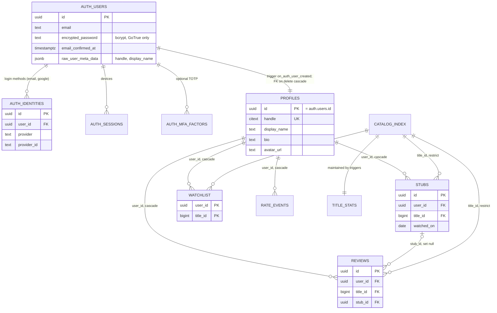

# ADR-010: Identity model (accounts, logins, sessions)

Status: **Accepted** · Date: 2026-09-27 · Decider: Architect (final call)
Inputs: founder update 2026-09-27 ("an identity table like IDS"), ADR-005, PRD B1–B3/E5, `supabase/migrations/20260926000000_init.sql:125-169`,
`src/server/ports.ts:111-139`, `src/server/auth/{supabase,local,password,demo-session}.ts`, ARCH_REVIEW AR-5, NEXT_PHASE_PLAN L-2/A1.1.
Extends ADR-005 (auth flows) and does not replace it.

## 1. Verdict

**Yes, there is a dedicated identity store, and it is not our own table.** Logins live in Supabase Auth's `auth` schema
(`auth.users`, `auth.identities`, `auth.sessions`, `auth.refresh_tokens`, `auth.mfa_factors`). That is the "IDS". Everything the
product shows about a person lives in **`public.profiles`**, which is 1:1 with `auth.users` and is created by a trigger in the
same transaction as the user. Nothing in the app stores a password, a password hash or a refresh token in live mode.

## 2. Identity store vs profile (what is stored where)

| Store | Owner | Holds | Never holds | Who can read |
|---|---|---|---|---|
| `auth.users` | Supabase Auth (GoTrue) | user id (uuid), email, `encrypted_password` (bcrypt), `email_confirmed_at`, `last_sign_in_at`, `raw_user_meta_data` (`handle`, `display_name` at sign-up only), banned/deleted flags | product data | Service role and GoTrue only. Not exposed through PostgREST |
| `auth.identities` | Supabase Auth | one row per login method per user: `provider` = `email` / `google` / …, provider subject id, provider profile JSON | passwords | same as above |
| `auth.sessions`, `auth.refresh_tokens` | Supabase Auth | one row per signed-in device, rotating refresh tokens | access tokens (those are stateless JWTs) | same as above |
| `auth.mfa_factors`, `auth.mfa_challenges` | Supabase Auth | TOTP secrets (if MFA is turned on, §6) | — | same as above |
| `public.profiles` | **us** | `id` (= `auth.users.id`, FK `on delete cascade`), `handle` (citext unique, immutable), `display_name`, `bio`, `avatar_url`, timestamps | email, password, tokens | public read (RLS); owner updates `display_name`/`bio`/`avatar_url` only (column grants) |
| `public.stubs`, `reviews`, `watchlist`, `rate_events` | us | product data keyed by `user_id → profiles.id` (`on delete cascade`) | identity data | RLS per ADR-005 |

Rule: **email stays in `auth.users` only.** The app reads it from the session (`getUser()`), never copies it into a public table,
and never puts it in logs or error payloads (ADR-011 §8).

## 3. ER diagram

## 4. How each piece works (plain terms)

- **Account creation.** `POST /api/auth/signup` → `auth.signUp({ email, password, options.data: { handle, display_name } })`.
  GoTrue inserts `auth.users` + an `email` row in `auth.identities`. The `on_auth_user_created` trigger (`init.sql:151-169`)
  inserts `public.profiles` in the **same transaction**, so a user without a profile cannot exist. A taken handle fails the
  whole sign-up (`handle_taken`). OAuth users without a handle get `user_xxxxxxxx` and can pick a display name later.
- **Password hashing.** Live: bcrypt inside GoTrue; our code never sees the hash. Passwords are 8–72 characters because bcrypt
  ignores bytes after 72 (`signUpSchema`). Demo: scrypt N=16384, r=8, p=1, 16-byte salt, timing-safe compare
  (`src/server/auth/password.ts:5-30`), stored in the demo JSON store only.
- **Sessions and cookies.** GoTrue issues a short-lived access JWT (default 1 h) and a rotating refresh token. `@supabase/ssr`
  stores them in `sb-<project>-auth-token` cookies: httpOnly, `Secure` in production, `SameSite=Lax`, path `/`. `src/proxy.ts`
  refreshes them. Server code validates with `auth.getUser()` (ADR-005). AR-5 (move to local `getClaims()` with asymmetric keys)
  stays a **Later** item: latency, not correctness. Demo: signed `stubbed_demo_session` cookie (HMAC-SHA256, 30 days).
- **Magic link.** `signInWithOtp({ shouldCreateUser: false })`, PKCE code exchanged at `/auth/callback`, redirect limited to
  same-origin paths (`safeNext`). The route always answers 202, so it never reveals whether an email exists. It is also the
  password-recovery path today (§7 task ID-2 adds "set a new password").
- **OAuth readiness.** Google (P1) needs only: a Google Cloud OAuth client (free), the provider switched on in Supabase, and a
  "Continue with Google" button calling `signInWithOAuth({ provider: 'google', options: { redirectTo: <origin>/auth/callback } })`.
  The callback route, the trigger's handle fallback and `auth.identities` already cover it. Account linking (same email, two
  providers) is GoTrue's automatic linking for verified emails. No schema change.
- **MFA option.** GoTrue supports TOTP factors (`auth.mfa.enroll/challenge/verify`, `aal2` in the JWT). **Not enabled for MVP**:
  there is nothing high-value to protect (public diaries, no payments). When needed, add it behind Settings and require
  `aal2` only for account deletion and email change. No schema change.
- **Account deletion.** `DELETE /api/me` → service-role `auth.admin.deleteUser(id)` (hard delete). Postgres cascades
  `auth.users → profiles → stubs / reviews / watchlist / rate_events`; `auth.identities`, `auth.sessions` and refresh tokens go with
  the user; the `title_stats` triggers fire per cascaded row so community counts drop. `catalog_index` rows are untouched
  (`restrict` only guards titles, not users). Then the cookies are cleared. The live cascade is verified in the staging smoke (L-2).
  Backups (ADR-011 §7) keep a deleted user for at most the backup retention (14 days); the privacy page must say so.

## 5. Why we do not hand-roll a password table

1. **Security surface.** A home-made `users(password_hash)` table means we own hashing parameters, reset tokens, token expiry,
   brute-force lockout, session revocation, email-change confirmation and breach response. GoTrue does all of that and is audited
   and patched upstream. PRD E5 asks for "no password handling in our code".
2. **It is free.** Supabase Auth is included in the Free plan up to 50,000 MAU, which is above our 12-month target.
3. **RLS depends on it.** `auth.uid()` in every policy comes from the GoTrue JWT. A custom table would need our own JWT minting
   to keep RLS, which is more code and more risk.
4. **Portability is kept anyway** (§8): the `AuthProvider` port and the demo `LocalAuthProvider` prove the app does not depend on
   Supabase-specific identity code outside one adapter.

## 6. Settings we fix in the Supabase dashboard (documented, not code)

| Setting | Launch value | Why |
|---|---|---|
| Confirm email | **OFF** at launch; the code must also work with it ON (task ID-1) | B1-AC3 "signed in immediately". Flip ON without a deploy if sign-up abuse appears |
| Custom SMTP | **Required** (Resend free: 3,000/month, 100/day) | Supabase's built-in mailer is for testing and heavily rate-limited, so magic links would fail at launch |
| Site URL / Redirect URLs | production origin + staging origin + `/auth/callback` | PKCE redirect allow-list |
| Minimum password length | 8 (matches `signUpSchema`) | One rule in two places; QA checks both |
| Auth rate limits | Supabase defaults, plus ours per IP (`src/server/rate-limit.ts`) | See ID-4: GoTrue sees our **server's** IP, so its per-IP limits are shared by all users |
| MFA (TOTP) | available, not offered in UI | §4 |
| JWT expiry | 3600 s (default) | Refresh handled by `proxy.ts` |

## 7. Missing for launch (decided)

| id | Task | Class | Owner |
|---|---|---|---|
| ID-1 | **Confirm-email-safe sign-up.** Today `signUp` throws when GoTrue returns a user without a session (`src/server/auth/supabase.ts:133-134`), so turning "Confirm email" ON breaks sign-up. Return `202 { session: null, confirmEmail: true }` instead; the UI shows "Check your inbox to finish signing up". Demo mode never returns it | **Must (M1)** | backend-dev (route + adapter + `contracts.ts` `AuthResponse`), frontend-dev (AuthForm message) |
| ID-2 | **Password reset = "Set a new password".** Magic link signs the user in; Settings then offers "Set a new password" → `PUT /api/auth/password { password }` (Supabase `updateUser`; demo: re-hash). Requires a session whose last sign-in is < 10 min old, else `401 reauth_required` with "Sign in again to change your password". Min/max length as sign-up. Other sessions stay valid (documented). This closes the PRD MVP "password reset" row (moved from M2 A1.1 into M1) | **Must (M1)** | backend-dev (route, port method `updatePassword`), frontend-dev (Settings form) |
| ID-3 | **Custom SMTP + templates.** Resend domain verification, Supabase SMTP settings, magic-link and confirm-signup templates branded "Stubbed" | **Must (M1)** | founder (accounts) · checked in L-2 |
| ID-4 | **Correct client IP for auth limits on any host** (`TRUSTED_PROXY`, ADR-001 §A3) and pass it on: our own per-IP limits are the real brute-force guard because GoTrue sees the server IP | **Must (M1)** | backend-dev |
| ID-5 | **Magic-link per-email limit** in addition to per-IP (5 per email per hour, in memory keyed by a SHA-256 of the lower-cased email, never the raw email) so one inbox cannot be flooded from many IPs | **Should (M1)** | backend-dev |
| ID-6 | **Privacy wording**: what we store (email in the identity store, public profile/diary), deletion is immediate, backups keep data ≤ 14 days | **Must (M1)** | frontend-dev (`/about` copy) |
| ID-7 | Verified-email gate before the first public review; MFA UI; Google button | **Later** (v1) | — |

Not missing (checked): unique handle, reserved handles (`init.sql:134-138`), generic sign-in errors, session cookie flags,
delete cascade, no email in public tables, RLS on every user table.

## 8. Portability: the identity layer if the DB provider changes

The app talks to identity through **one port**, `AuthProvider` (`src/server/ports.ts:111-139`): `getSession`, `signUp`, `signIn`,
`signOut`, `sendMagicLink`, `isHandleAvailable`, `completeCallback`, `deleteAccount` (+ `updatePassword` from ID-2). Pages,
routes and repositories only see `Session { userId, handle, … }`. Two adapters exist today (`supabase.ts`, `local.ts`), which
proves the seam.

What moving off Supabase Auth would take (for example to Neon + Better Auth, ADR-001 §A2):
1. A new adapter `src/server/auth/<provider>.ts` implementing the port; `container.ts` picks it from env.
2. Users table: the new provider's `user` table replaces `auth.users`; `profiles.id` becomes an FK to it (one migration). Keep
   the uuid values so every `user_id` stays valid.
3. **Passwords:** export `auth.users.encrypted_password` (bcrypt) and import it as-is; Better Auth and most libraries can verify
   bcrypt, so users do not have to reset. OAuth identities move by provider subject id.
4. **RLS:** replace `auth.uid()` with a helper that reads the user id from the new provider's JWT claim
   (`current_setting('request.jwt.claims', true)::jsonb ->> 'sub'`), or drop to app-layer checks if the new DB has no
   PostgREST. The DAL already filters every write by the session user id (ADR-005 §Authorisation 1), so RLS is the second line.
5. Cookie names change, so all users sign in once more. Nothing else in `src/app/**` or `src/components/**` changes.

Estimated effort: 2–3 days for the adapter, migration and a rehearsed user import on staging.

## 9. Consequences

- Identity data has a single owner (GoTrue), product data has a single owner (us), joined by one uuid.
- Two M1 code tasks (ID-1, ID-2) and two config tasks (ID-3, ID-4) are added to WORK_SPLIT §5.
- A Supabase outage also stops sign-in; public pages degrade per ADR-011 §4.
